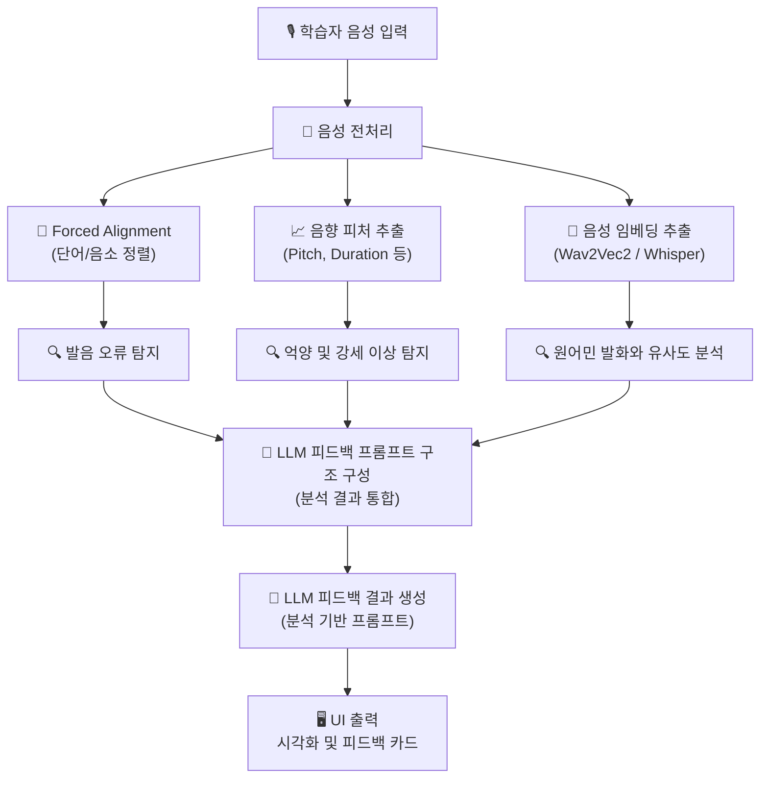
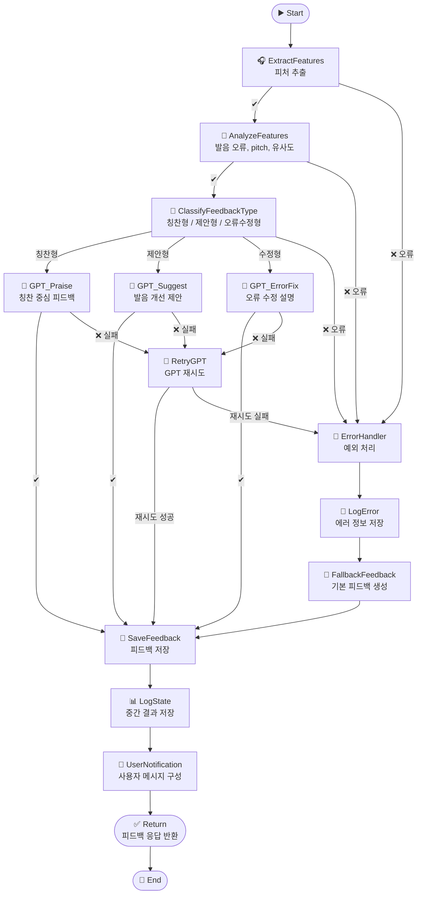

# ⚙️ Koach - 한국어 발음 교정 AI 코치: 기술 문서

> Koach = Korean + Coach

---

## 🧠 시스템 개요

**Koach**는 한국어 발화의 음향/음소적 특징을 정량 분석하고  
LLM(Large Language Model) 기반 자연어 피드백을 제공하는 **하이브리드 음성 교정 시스템**입니다.

---

## 🧱 시스템 아키텍처

> GitHub에서 mermaid 다이어그램을 보려면, 해당 저장소에서 `mermaid.js` 지원이 필요합니다.

<details>
<summary>시스템 설계 아키텍처</summary>



</details>

<details>
<summary>시스템 구현 아키텍처 (LangGraph)</summary>



</details>

---

## 🔧 구성 요소별 기술 설명

### 1. 음성 입력 및 전처리

- 입력 포맷: `.wav`, `.mp3`
- 표준화: 16kHz 샘플링, 모노 채널
- 라이브러리: `librosa`, `pydub`

**예시 코드:**

```python
import librosa
y, sr = librosa.load("input.wav", sr=16000)
```

---

### 2. Forced Alignment

- 도구: **Montreal Forced Aligner (MFA)**
- 추가 도구: **Gentle** (한국어 지원 강화)
- 목적: 사용자 음성과 전사 텍스트를 정렬하여 **음소 단위 시간 정보** 추출
- 출력 형식: `.TextGrid`, `.json` (단어 및 음소의 시작/끝 시간 포함)

**예시 명령어:**

```bash
mfa align corpus/ dict/ korean_model output/
```

corpus/: 발화 음성 파일 디렉토리
dict/: 발음 사전 (예: korean.dict)
korean_model: 학습된 한국어 음향 모델
output/: 정렬 결과 저장 폴더

---

### 3. 음성 임베딩 추출

- 사용 모델: wav2vec2, Whisper, HuBERT
- 방식:
  - MFA 결과로 분리된 어절 단위 구간 사용
  - 각 구간에서 평균 임베딩 벡터 추출

예시 코드 (Wav2Vec2):

```python
from transformers import Wav2Vec2Processor, Wav2Vec2Model
import torch

processor = Wav2Vec2Processor.from_pretrained("facebook/wav2vec2-large-xlsr-53")
model = Wav2Vec2Model.from_pretrained("facebook/wav2vec2-large-xlsr-53")

input_values = processor(audio_array, sampling_rate=16000, return_tensors="pt").input_values

with torch.no_grad():
    embeddings = model(input_values).last_hidden_state
```

---

### 4. 발음 오류 탐지

정렬 결과와 음향 피처를 기반으로 발음 오류를 자동 탐지합니다.
MFA 정렬 실패, 발화 길이, 음절 이상 여부 등을 기준으로 판단합니다.

| 오류 유형 | 기준 설명                                                 |
| --------- | --------------------------------------------------------- |
| 누락      | 음소가 정렬되지 않음 (MFA 미정렬)                         |
| 왜곡      | 음소 길이가 비정상적으로 짧음 (예: ≤ 50ms)                |
| 치환      | 예상 음소와 실제 음소가 다름 (ASR 기반 비교, 선택적 적용) |
| 추가      | 불필요한 음소가 삽입됨 (예: 받침 발음 오류)              |
| 연음      | 음소 간 경계가 불명확하거나 과도하게 연결됨              |

---

### 5. 억양 및 강세 이상 탐지

- 도구: praat, parselmouth, librosa
- 분석 피처:
  - Pitch (F0): 억양 곡선
  - Energy: 발화 강도
  - Duration: 음소 또는 어절 길이
  - 비교 방법: 원어민 발화와 학습자 발화 간 곡선 유사도 (DTW 기반 등)

예시 코드 (parselmouth):

```python
import parselmouth

sound = parselmouth.Sound("input.wav")
pitch = sound.to_pitch()
pitch_values = pitch.selected_array['frequency']
```

---

### 6. 분석 결과 구조 예시

분석 결과는 JSON 구조로 생성되며, GPT 피드백 생성을 위한 입력으로 사용됩니다.

```json
{
  "word": "감사합니다",
  "similarity": 0.72,
  "pitch_issue": true,
  "phoneme_errors": [{ "phoneme": "ㅁ", "error": "누락" }]
}
```

---

### 7. LLM 피드백 생성

- 사용 모델: GPT-4, Claude, KoGPT 등
- 피드백 유형:
  - 칭찬형: 잘 발음된 부분 강조
  - 제안형: 개선이 필요한 부분에 대한 구체적 제안
  - 수정형: 명확한 오류에 대한 교정 지시
- 피드백 구조:
  - 문제 지점 명시
  - 원어민 발음 특징 설명
  - 구체적인 연습 방법 제시
  - 예시 단어/문장 포함

예시 프롬프트:

```
"감사합니다" 어절에서 pitch가 낮고, 'ㅁ' 발음이 누락되었습니다.
자연스럽게 발음하는 방법을 알려주세요.
```

- 출력: 자연어로 구성된 발음 피드백 문장

---

~~### 8. 예시 발화 검색 (RAG 기반)~~

~~- 방식: 학습자 어절 임베딩 → 벡터 DB → 유사도 기반 검색~~
~~- 기술: FAISS, Pinecone, Chroma~~
~~- 목적: 유사한 원어민 발화 예시 제공 (Top-K 검색)~~

---

### 9. 시각화 UI 구성

| 구성 요소         | 설명                                                 |
| ----------------- | ---------------------------------------------------- |
| 유사도 히트맵     | 어절별 발음 정확도를 색상으로 시각화                 |
| Pitch 곡선 그래프 | 원어민과 학습자의 pitch 곡선을 시각적으로 비교       |
| 오류 하이라이트   | 누락, 왜곡된 음소를 시각적으로 강조                  |
| GPT 피드백 카드   | 자연어 기반 피드백을 카드 형태로 사용자에게 제공     |
| 예시 발화 재생    | 유사 원어민 발화 예시를 오디오로 재생할 수 있는 기능 |
| 발음 진단 차트    | 전체 발음 정확도, 억양, 강세 등의 종합 점수 표시     |
| 연습 가이드       | 단계별 발음 연습 방법을 시각적으로 안내              |

---

## 🛠️ 기술 스택 요약

| 분야        | 사용 기술                                           |
| ----------- | --------------------------------------------------- |
| 음성 분석   | `librosa`, `parselmouth`, `praat`                   |
| 임베딩 추출 | `wav2vec2`, `Whisper`, `HuBERT`                     |
| 정렬        | `Montreal Forced Aligner (MFA)`, `aeneas`, `Gentle` |
| 언어 모델   | `GPT-4`, `Claude`, `KoGPT`                          |
| 벡터 검색   | `FAISS`, `Pinecone`, `Chroma`                       |
| 백엔드      | `FastAPI`, `Flask`, `Django`                        |
| 프론트엔드  | `React`, `TailwindCSS`, `D3.js`                     |
| 데이터 저장 | `PostgreSQL`, `MongoDB`, `Amazon S3`                |

---

## 👨‍💻 프로젝트 기여 요약

| 항목            | 기여 내용                                                                 |
| --------------- | ------------------------------------------------------------------------- |
| 시스템 설계     | 전체 파이프라인 아키텍처 설계 및 모듈 간 데이터 흐름 정의                 |
| 음성 처리       | 전처리, 정렬, 피처 추출, 오류 탐지 알고리즘 구현                          |
| GPT 피드백 설계 | 분석 결과 기반 구조화 → GPT 프롬프트 작성 및 출력 형식 구성               |
| UI 시각화       | 피드백 카드, 히트맵, Pitch 곡선 등 사용자 친화적 시각화 요소 기획 및 구현 |

---

## 📬 문의

- 이메일: contact@koach.ai
- GitHub Issues 또는 LinkedIn DM으로 문의해 주세요.
